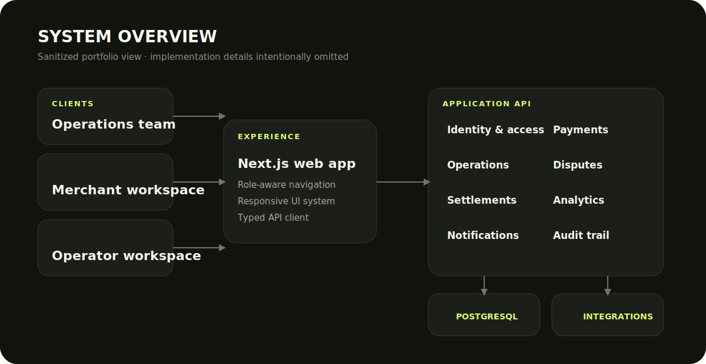

# Voyage Pay — портфолио проекта

> Безопасная демонстрационная версия для портфолио. Исходный код production-системы,
> инфраструктура, учётные данные, интеграции, бизнес-правила и пользовательские
> данные остаются закрытыми.

Voyage Pay — многоролевая операционная платформа для команд, которые координируют
платёжные процессы с большим количеством операций. Этот репозиторий демонстрирует
продуктовый подход, интерфейсную систему и ключевые инженерные решения проекта,
не раскрывая его рабочую реализацию.

**Рабочий сервис:** [voyagepay.pro](https://voyagepay.pro)

## Демонстрация

Откройте файл [`index.html`](./index.html) в браузере. Это автономный статический
прототип без внешних зависимостей и сетевых запросов. Все представленные данные
являются вымышленными.

В прототипе реализованы:

- операционная панель с адаптивной навигацией;
- поиск и фильтрация операций по статусу;
- компактное представление аналитики;
- интерфейсная структура с учётом разных ролей;
- переключение светлой и тёмной темы;
- адаптивное и доступное поведение интерфейса.

## Мой вклад

- Проектирование продукта и моделирование рабочих процессов
- Разработка backend-архитектуры на NestJS, TypeORM, PostgreSQL и Redis
- Реализация frontend-приложения на Next.js, React, TypeScript и Tailwind CSS
- Ролевая модель доступа для владельца, администратора, мерчанта, тимлида и оператора
- Процессы обработки платежей, споров, выводов, уведомлений и аналитики
- Механизмы безопасности для авторизации, webhook-запросов, данных кошельков и URL
- Локальная среда на Docker и конфигурация облачного развёртывания

## Архитектура рабочей системы

Публичная схема намеренно показывает архитектуру только на уровне основных
компонентов:

Подробнее о проекте можно прочитать в [разборе проекта](./docs/case-study.md),
а правила разделения публичной и закрытой частей описаны в документе
[«Границы публикации»](./docs/publication-boundary.md).

## Технологии

`Next.js` · `React` · `TypeScript` · `Tailwind CSS` · `NestJS` · `PostgreSQL` ·
`TypeORM` · `Redis` · `Docker`

## Политика репозитория

Showcase не содержит production-кода или секретов. Все имена, суммы, события и
идентификаторы в демонстрации вымышлены. Права на свободное переиспользование
визуального дизайна, текстовых материалов и исходного кода не предоставляются,
если иное отдельно не согласовано с автором.
